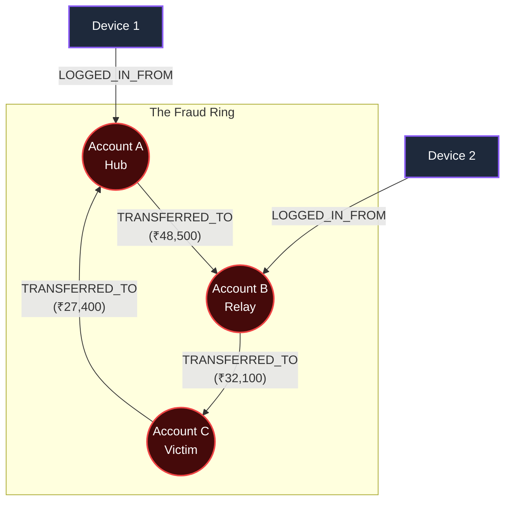

# 🏦 Neural Banking Map: Visual Architecture

> [!IMPORTANT]
> The Neural Banking Map uses a 4-Tier Graph Intelligence Engine designed to detect circular money-laundering rings (A → B → C → A) that standard ML models completely miss.

## 🔄 End-to-End System Flow

Whenever a transaction hits the system, here is the exact lifecycle visualized:

```mermaid
sequenceDiagram
    autonumber
    participant FE as Frontend UI
    participant API as main.py (FastAPI)
    participant ML as inference.py (PyTorch)
    participant DB as queries.py (Neo4j)
    participant AI as langchain_agent.py (LLM)

    FE->>API: POST /transaction
    Note over API: Extracts {upi_id, amount}
    API->>ML: predict_transaction()
    Note over ML: Builds 11-feature tensor
    ML->>ML: Pass through SAGEConv layers
    ML-->>API: returns confidence: 0.92
    
    rect rgb(50, 20, 20)
    Note right of API: THRESHOLD CROSSED (>75%)
    API->>DB: detect_cycles(upi_id)
    Note over DB: Cypher DFS (max 6 hops)
    DB-->>API: Ring Detected: [A, B, C, A]
    
    API->>AI: run_fraud_agent(ring_data, confidence)
    Note over AI: OpenAI evaluates context
    AI->>DB: Tool: freeze_account()
    DB-->>AI: Confirmation (Node frozen)
    AI-->>API: Tool: draft_sar() 
    Note right of AI: Returns structured Markdown Report
    end

    API->>DB: store_transaction()
    API-->>FE: Return AI Report + Alerts
```

## 📂 Codebase Breakdown

Here is exactly what each file guarantees in the application:

| Component | File Path | Primary Role | Core Technologies |
|:---|:---|:---|:---|
| 🚦 **The Conductor** | `backend/main.py` | Orchestrates the entire pipeline. Holds the `lifespan` startup, REST routes, and WebSocket streams. | FastAPI, Python async |
| 🧠 **The Brain** | `backend/inference.py` | Mathematical analysis. Reads `graphsage.pt` into memory and scales incoming raw data into 11-feature vectors. | PyTorch, PyTorch Geometric |
| 🗄️ **The Memory** | `backend/graph/queries.py` | Physical graph storage. Contains the exact Cypher language needed to find mastermind PageRank hubs. | Neo4j, Python Driver |
| 🤖 **The Enforcer** | `backend/agent/langchain_agent.py` | Autonomous reasoning. Takes the graph context and uses `freeze_account` and `draft_sar` tools to secure the platform. | LangChain, GPT-4o-mini |

## 🧬 Inside The 4-Tier Engine

### 1️⃣ Tier 1 & 2: Graph Database (`queries.py`)
> [!NOTE]
> Cypher queries execute **DFS (Depth-First Search)** algorithms. They act as detectives, tracing funds up to 6 hops away and checking for a circular topology within strict 24-hour windows.

### 2️⃣ Tier 3: Graph Neural Network (`inference.py`)
> [!TIP]
> Your `graphsage.pt` model doesn't just look at the money. It uses two `SAGEConv` layers to map 11 highly specific situational features (like `orig_balance_diff` and `step_norm`) into a 64-dimensional hidden state to predict fraud algebraically.

### 3️⃣ Tier 4: Agentic Reasoning (`langchain_agent.py`)
> [!WARNING]
> When the system triggers the LLM, it grants OpenAI access to **live mutating tools**. The AI dynamically decides if/when to fire the `freeze_account` function to physically alter the Neo4j node schemas and stop the criminals.

---

### 🕸️ Graph Representation

When `GET /graph/fraud` is called by your upcoming frontend, it delivers this exact topology:

